# MAOS UI Designer Full-Coverage Capability Map

Generated from `tests/fixtures/capability_map_prompt.md`.

## Clarifying Questions

I can proceed with explicit assumptions, but these three clarifying questions would materially change the UI surface, framework, safety model, and implementation plan:

1. Is the first deliverable a responsive web console, a Figma prototype, or both?
2. Should the implementation use an existing frontend framework, or should I assume React + TypeScript for a greenfield Web B2B admin console?
3. Are command dispatch actions safety-critical enough to require two-person approval, command simulation, receipt replay, and audit export?

Assumptions used for this generated response:

- Surface: responsive web console first, with a Figma handoff later.
- Framework: React + TypeScript, no existing codebase detected.
- Risk: high risk, because edge command and device execution can affect field equipment.
- Users: operations commander, edge node administrator, device maintenance operator, and AI decision auditor.

## Design Context

Context: industrial IoT and edge operations / command-center operational / neutral workbench with enterprise blue, ops amber, and semantic status colors / responsive web app / compact daily-use density / high risk and safety-critical command execution.

- Industry: industrial IoT, edge intelligence, B2B operations, and device command control.
- Style: command-center, operational, data-dense, and audit-ready.
- Palette: neutral workbench surfaces, enterprise blue for navigation and command identity, success green for healthy nodes, ops amber for warning and stale states, danger red for destructive or unsafe command states.
- Surface: responsive web app optimized for desktop command center, tablet field review, and mobile alert handoff.
- Density: compact daily-use console with expandable high-stakes detail panels.
- Risk: high risk because permissions, destructive actions, disconnected nodes, command timeout, and audit evidence are central workflows.

Top information priorities:

1. Fleet and mission risk: current command posture, degraded nodes, active alerts, and receipt health.
2. Action readiness: which missions, commands, assets, and devices are actionable under current permission and connectivity.
3. Audit confidence: evidence trail, AI decision provenance, receipt timeline, and operator approval chain.

## Product Model

Core objects:

- Mission: planned or active operation with targets, commands, approvals, status, and receipts.
- EdgeNode: regional node with connectivity, workload, local autonomy mode, and last sync freshness.
- Device: robot, radar, camera, drone, beacon, relay, or other edge execution object.
- Alert: event requiring triage, acknowledgement, escalation, or command response.
- Command: typed instruction with target, payload, safety checks, timeout, approval, and receipt.
- Evidence: telemetry, logs, images, map snapshots, AI trace, operator notes, and command receipts.
- AgentDecisionRun: AI decision, planning result, confidence, constraints, and review state.
- UserRole: commander, node admin, maintainer, auditor, and read-only observer.

Relationships:

- Mission owns commands, target groups, evidence, approvals, and receipts.
- EdgeNode manages local devices, node health, autonomy mode, and command relay state.
- Device belongs to a node, reports telemetry, receives commands, and emits receipts.
- Alert links to mission, node, device, evidence, and optional AI decision run.
- Command links to one or more targets, permission checks, approval chain, timeout state, and receipt timeline.

Success signal:

The user can understand operational posture, decide what needs attention, dispatch or withhold a command safely, and later prove why the decision was made.

## AI-Friendly Framework Gate

The UI framework and component library must pass the AI-friendly UI / agent-maintainable UI gate before product defaults are applied.

Gate checks:

- Typed API: TypeScript props, typed table columns, typed form schemas, typed command payloads, typed chart data, and typed status variants.
- Token/theming: centralized theme tokens for color, spacing, radius, typography, elevation, density, and motion.
- Semantic wrappers: product/domain wrappers around generic primitives instead of scattered raw UI kit usage.
- Accessibility: keyboard navigation, focus rings, labels, roles, screen-reader names, and non-color-only status indicators.
- Predictable styling: one app-owned styling system, limited overrides, no magic numbers, and no direct CSS overrides against library internals.
- Stable testing: stable selectors, `data-testid`, `rowKey`, named forms, deterministic loading states, and screenshot-friendly fixtures.
- Documentation gravity: framework and component examples are common enough that future agents can infer the right pattern.

Recommended stack:

- Frontend framework: React + TypeScript. Use Next.js + TypeScript if routing, server rendering, auth boundaries, or app shell conventions are needed.
- UI component library: Ant Design for Web B2B/admin density, wrapped by domain components.
- Styling system: StyleX for app-owned layout, state variants, and semantic token composition; Ant Design ConfigProvider theme tokens for library primitives.
- Charting library: ECharts for dense command-center visualization, with typed chart adapters; AntV can be added for graph topology if the product needs deep network visualization.
- Icon library: lucide-react for generic UI controls, plus a small local domain icon set for mission, edge node, device, alert, command, receipt, and audit.
- Map/topology layer: Mapbox or Deck.gl only if geographic positioning or live topology is central; otherwise start with a typed topology panel backed by ECharts or AntV.

Ant Design judgment:

Ant Design fits the Web B2B/admin surface because it provides mature Table, Form, Drawer, Modal, Tabs, Tree, Steps, Timeline, Descriptions, Badge, Tag, Dropdown, Notification, and ConfigProvider primitives. It passes the B2B component coverage requirement, but it needs constraints to remain AI-friendly:

- Use domain wrappers such as `MissionTable`, `CommandDrawer`, `NodeHealthPanel`, `AlertTimeline`, `EvidenceViewer`, `PermissionGate`, and `RiskStatusTag`.
- Keep raw Ant Design `Table`, `Form`, `Drawer`, and `Modal` usage inside wrapper components or small page sections with clear ownership.
- Put theme token overrides in one provider and map them to semantic tokens.
- Use stable `rowKey` values for missions, edge nodes, devices, alerts, commands, receipts, and agent decision runs.
- Avoid scattered CSS overrides against Ant Design internals.
- Use typed chart adapters instead of inline ECharts option objects inside pages.

## UI Capability Map

```mermaid
flowchart TB
  A["Input Intake: brief / screenshot / codebase / Figma / incident log"] --> B["Clarification Layer: surface / workflow / framework / component library / safety risk"]
  B --> C["Design Context Selection: industry / style / palette / responsive web surface / compact density / high risk"]
  C --> D["AI-Friendly Framework Gate: typed API / tokens / semantic wrappers / accessibility / stable testing"]
  D --> E["Product Model: mission / edge node / device / alert / command / evidence / agent decision run"]
  E --> F["Information Architecture: command console / mission queue / node topology / alert triage / audit trail"]
  F --> G["Navigation Shell: fleet overview / missions / alerts / commands / evidence / audits / settings"]
  G --> H["Primary Work Surface: live operational posture / active missions / degraded nodes / pending approvals"]
  H --> I["Component System: MissionTable / NodeHealthPanel / CommandDrawer / AlertTimeline / EvidenceViewer"]
  I --> J["State System: loading / skeleton / empty / error / retry / stale / partial / disconnected"]
  J --> K["Command Safety System: permission-limited / destructive confirmation / two-person approval / timeout / receipt pending / failed"]
  K --> L["Visualization System: topology map / alert trend chart / node health matrix / command receipt timeline"]
  L --> M["Token And Styling System: semantic tokens / StyleX variants / Ant Design ConfigProvider theme tokens"]
  M --> N["Accessibility And Test Hooks: keyboard path / focus / labels / rowKey / data-testid / screenshot fixtures"]
  N --> O["Responsive QA: desktop command center / tablet field review / mobile alert handoff"]
  O --> P["Implementation Handoff: domain wrappers / typed fixtures / QA acceptance checklist / design review"]
```

## Information Architecture

Primary navigation:

- Overview: real-time fleet posture, active missions, degraded edge nodes, top alerts, and command receipt health.
- Missions: mission queue, mission detail, target selection, approval state, command history, and evidence.
- Nodes: node topology, edge node detail, device inventory, autonomy mode, local sync, and command relay status.
- Alerts: triage queue, severity filters, acknowledgement, escalation, evidence, and linked commands.
- Commands: command templates, dispatch history, pending approvals, timeouts, failed receipts, and replay.
- Evidence: logs, telemetry, snapshots, AI traces, receipt bundles, and export packages.
- Audits: decision run review, operator actions, approval chain, command replay, and compliance reports.
- Settings: roles, permissions, command policy, node policy, notification routing, and token/theme configuration.

Main screen layout:

- Header: environment switcher, global search, command safety indicator, active incident indicator, user role, and notification center.
- Left rail: primary navigation with active risk badges.
- Top summary band: fleet health, active missions, critical alerts, disconnected nodes, pending approvals, failed receipts.
- Primary pane: mission and alert work queue with filters, sorting, tabs, row selection, and bulk acknowledgement.
- Secondary pane: selected object detail, evidence preview, receipt timeline, and AI decision summary.
- Command drawer: target preview, payload diff, policy checks, two-person approval, timeout, and receipt progress.

Responsive behavior:

- Desktop: three-region command center with table, topology, and detail drawer.
- Tablet: collapses secondary pane into tabs and keeps command actions in a sticky bottom bar.
- Mobile: alert handoff and approval review only; high-risk command authoring remains disabled unless explicitly supported.

## Component System

Product/domain components:

- `CommandCenterShell`: app shell, role-aware navigation, global command safety state, and incident banner.
- `FleetPostureSummary`: compact KPI strip for active missions, degraded nodes, critical alerts, pending approvals, failed receipts, and stale data.
- `MissionTable`: typed columns, `rowKey`, severity tags, command status, receipt count, owner, freshness, filters, sorting, selection, and bulk actions.
- `MissionDetailPanel`: mission objective, target group, linked alerts, command history, receipts, and evidence.
- `NodeTopologyPanel`: topology map, node freshness, relay health, local autonomy mode, and disconnected state.
- `NodeHealthPanel`: CPU, connectivity, workload, command queue, local fallback mode, last sync, and health trend chart.
- `DeviceInventoryTable`: devices by type, node, capability, status, battery, signal, last receipt, and command eligibility.
- `AlertTriageQueue`: severity, source, evidence count, acknowledgement state, escalation owner, and linked command recommendation.
- `AlertTimeline`: event chronology, evidence, operator notes, AI trace, acknowledgement, escalation, and recovery.
- `CommandDrawer`: target selection, command payload, policy checks, approval workflow, destructive confirmation, timeout, receipt pending, failed, retry, and rollback guidance.
- `CommandReceiptTimeline`: queued, sent, received, executed, timed out, failed, retried, and operator acknowledged states.
- `AgentDecisionReview`: decision summary, confidence, constraints, evidence links, policy violations, human override, and audit status.
- `EvidenceViewer`: telemetry, logs, image snapshots, video references, AI run traces, command receipts, and export.
- `RiskStatusTag`: semantic wrapper for normal, success, warning, danger, stale, disconnected, unknown, and permission-limited tones.
- `PermissionGate`: role gate with disabled reason, escalation path, and audit explanation.

Component API rules:

- Components expose typed props and explicit variants instead of raw color or layout props.
- Product states use predictable names such as `loading`, `empty`, `error`, `stale`, `disconnected`, `permissionLimited`, `approvalRequired`, `receiptPending`, and `commandFailed`.
- Tables use typed columns and stable `rowKey`.
- Forms use typed schemas, stable field names, labels, helper text, validation, and recovery copy.
- Chart components receive normalized domain data, not raw ECharts options.

## State System And Operational Boundaries

Required state coverage:

- Loading: skeleton rows, loading chart regions, command policy checks in progress.
- Empty: no active missions, no alerts, no command receipts, no evidence, no eligible targets.
- Error: failed API request, chart data failed, command validation failed, evidence unavailable.
- Retry: retry fetch, retry receipt check, retry command send only when policy allows.
- Partial data: some nodes stale, some receipts missing, evidence still indexing.
- Stale data: explicit freshness timestamp, amber stale tone, and disabled command if freshness exceeds policy.
- Disconnected: edge node disconnected, device offline, local autonomy mode active, command relay unavailable.
- Permission-limited: role gate, disabled action, visible reason, escalation path, and audit note.
- Command pending: sent but no receipt yet, visible timeout clock and cancellation policy.
- Command failed: failed reason, target impact, retry eligibility, rollback or manual recovery path.
- Destructive action: confirmation copy names target, impact, timeout, and audit consequence.
- Two-person approval: requester, approver, timestamp, policy reason, and expiry.
- Success: receipt received, executed state, evidence attached, and audit trail updated.
- Hover/focus/selected/disabled: visible and keyboard-accessible states for table rows, command buttons, tags, and drawer controls.

Safety boundaries:

- High-risk command authoring requires target preview, policy checks, destructive confirmation, and two-person approval.
- Disconnected or stale nodes cannot receive normal commands unless local autonomy policy allows a queued command.
- Command replay is audit-only unless explicitly authorized.
- AI suggestions never dispatch directly; they create reviewable command drafts with provenance.

## Token And Styling Strategy

Semantic tokens:

- Color: `surface`, `surfaceRaised`, `border`, `text`, `muted`, `accent`, `success`, `warning`, `danger`, `stale`, `disconnected`, `permission`, `audit`.
- Spacing: `spaceInlineXs`, `spaceInlineSm`, `spacePanel`, `spaceSection`, `spaceDrawer`.
- Radius: `radiusControl`, `radiusPanel`, `radiusOverlay`.
- Typography: `typePageTitle`, `typeSectionTitle`, `typeTable`, `typeMeta`, `typeCode`, `typeStatus`.
- Elevation: `elevationNone`, `elevationPanel`, `elevationDrawer`, `elevationModal`.
- Motion: `motionInstant`, `motionFast`, `motionStandard`, with reduced-motion support.

StyleX usage:

- Use StyleX for app-owned layout, typed variants, and tokenized static styles.
- Keep `stylex.create` blocks named by product intent, such as `missionQueue`, `commandSafety`, and `receiptTimeline`.
- Use dynamic styles only through explicit variant props and semantic tokens.

Ant Design theme:

- Use ConfigProvider theme tokens to align control height, border radius, primary color, warning color, danger color, font family, and table density.
- Keep library theming centralized, with no page-level one-off overrides.

## Visualization System

Visualization components:

- `FleetTopologyMap`: edge nodes, devices, relay paths, degraded links, disconnected regions, and selected mission scope.
- `AlertTrendChart`: alert volume, severity mix, acknowledgement time, and recovery trend.
- `NodeHealthMatrix`: node status by connectivity, workload, queue depth, freshness, and local autonomy mode.
- `CommandReceiptTimeline`: command lifecycle from draft to approval to send to receipt to execution to audit.
- `AgentDecisionTrace`: decision steps, evidence inputs, rejected alternatives, policy checks, and human override.

Chart guardrails:

- Use ECharts through typed chart adapters.
- Keep severity, freshness, status, and alert colors semantic.
- Provide loading, empty, partial, stale, and disconnected states for every chart.
- Avoid inline chart option objects in pages.
- Use accessible summaries for critical charts so status is not color-only.

## Permissions, Safety, And Audit

Roles:

- Operations commander: view posture, triage alerts, draft commands, request approvals, dispatch approved commands.
- Edge node administrator: manage nodes, inspect local autonomy, approve node-level policy changes, diagnose disconnected states.
- Device maintenance operator: inspect device state, attach evidence, perform allowed recovery actions, acknowledge maintenance tasks.
- AI decision auditor: review agent decision runs, evidence links, policy checks, overrides, and export audit packages.
- Observer: read-only posture and evidence access with no command actions.

Permission model:

- `PermissionGate` wraps action controls and exposes disabled reason, escalation owner, and audit impact.
- Destructive commands require confirmation and policy reason.
- Safety-critical commands require two-person approval.
- Role changes and policy updates are audit events.

Audit model:

- Every command stores target, payload, actor, approver, policy checks, timeout, receipts, evidence links, and replay metadata.
- AI decision runs store prompt/context, model or agent identity, confidence, constraints, evidence, recommendation, human review, and override reason.
- Audit export includes mission, alert, command, receipt, evidence, and decision-run lineage.

## Implementation Guardrails

- Use Ant Design through domain wrappers rather than raw scattered primitives.
- Use StyleX for app-owned layout and tokenized variants.
- Use ConfigProvider theme tokens for Ant Design controls.
- Use typed data fixtures for missions, edge nodes, devices, alerts, commands, receipts, evidence, and agent decision runs.
- Use stable selectors such as `data-testid="mission-table"`, `data-testid="command-drawer"`, and stable `rowKey` values.
- Use typed charts and chart adapters for ECharts or AntV.
- Keep command safety states explicit in UI and tests.
- Do not hide command risk inside generic modal text.
- Do not use nested cards inside cards for the command console.
- Do not rely on color alone for severity, disconnected, stale, or danger states.
- Do not mix multiple UI kits unless a migration plan exists.

## QA Acceptance Checklist

- Acceptance checklist confirms the response states the design context: industrial IoT, command-center style, neutral workbench palette, responsive web surface, compact daily-use density, and high risk.
- The framework choice passes the AI-friendly framework gate before selecting Ant Design.
- Ant Design is justified for Web B2B/admin density and constrained with ConfigProvider theme tokens, domain wrappers, typed table columns, stable `rowKey`, and limited overrides.
- The capability map includes input intake, clarification layer, design context, framework gate, product model, information architecture, component system, state system, visualization, permissions, safety, responsive QA, accessibility, test hooks, and implementation handoff.
- Product components use domain names such as `MissionTable`, `NodeHealthPanel`, `CommandDrawer`, `AlertTimeline`, `EvidenceViewer`, `PermissionGate`, and `RiskStatusTag`.
- State coverage includes loading, skeleton, empty, error, retry, partial data, stale data, disconnected node, permission-limited action, command pending, receipt pending, timeout, command failed, destructive confirmation, approval, and success.
- Token strategy maps raw colors to semantic tokens and keeps StyleX variants explicit.
- Visualization uses typed charts, ECharts or AntV adapters, semantic status colors, and accessible summaries.
- Permission and safety model covers role gates, destructive confirmation, two-person approval, audit replay, and evidence export.
- Responsive QA covers desktop command center, tablet field review, and mobile alert handoff.
- Accessibility and testing hooks cover keyboard path, focus, labels, roles, `data-testid`, stable selectors, and screenshot fixtures.
- Implementation guardrails are concrete enough to create frontend tasks, wrappers, token files, fixtures, tests, and visual QA checks.

## Evaluation Notes

This full-coverage sample is intentionally broader than the minimum golden fixture. It is meant to test whether `maos-ui-designer` can generate a product-grade capability map that connects design decisions to implementation constraints and automated QA.
