# MAOS UI Designer Capability Map

## Clarifying Questions

I can proceed with assumptions, but these three questions would materially change the design:

1. Is the first delivery a responsive web console, a Figma prototype, or both?
2. Should the implementation use the existing stack, or should I assume React + TypeScript?
3. Are command actions safety-critical enough to require two-person approval and audit replay?

Assumptions for this test: responsive web console, React + TypeScript, safety-critical operations.

## Design Context

Context: industrial IoT / command-center operational / neutral workbench with ops amber and semantic danger / responsive web app / compact daily-use / high risk.

- Industry: industrial IoT and edge operations.
- Style: data-dense command center for repeated daily use.
- Palette: neutral surfaces, blue command identity, green healthy states, amber warning states, red danger states.
- Surface: responsive web with future Figma handoff.
- Density: compact operator console with expandable audit detail.
- Risk: high, because command dispatch and device control can affect field equipment.

## AI-Friendly Framework Decision

AI-friendly gate:

- Typed API: TypeScript component props, typed table columns, typed command forms.
- Token/theming: semantic tokens for surface, text, muted, accent, success, warning, danger, stale, disconnected.
- Semantic wrappers: wrap generic primitives as product components.
- Accessibility: keyboard command path, focus states, labels, roles, and confirmation copy.
- Predictable styling: one styling system and constrained overrides.
- Stable testing: rowKey, data-testid, named form fields, deterministic loading and error states.

Recommended stack:

- Frontend: React + TypeScript, or Next.js + TypeScript if routing and server integration are needed.
- UI kit: Ant Design for B2B/admin density, with ConfigProvider theme tokens and typed domain wrappers.
- Styling system: StyleX for app-owned layouts and tokenized static styles; Ant Design tokens for library components.
- Charts: ECharts for dense status, alert, and trend visualization; wrap with typed chart adapters.
- Icons: lucide-react for general UI controls, with a small domain icon set for nodes, devices, missions, and commands.

Ant Design passes the B2B/admin fit because it provides mature Table, Form, Drawer, Modal, Tabs, Tree, Steps, Timeline, and ConfigProvider tokens. It needs AI-friendly constraints: no scattered raw Table/Form usage in pages, no one-off CSS overrides against internals, and no untyped chart config inline in screens.

## UI Capability Map

```mermaid
flowchart TB
  A["Input Intake: brief / screenshot / codebase / Figma"] --> B["Clarification Layer: surface / workflow / framework / risk"]
  B --> C["Design Context Matrix: industry / style / palette / surface / density / risk"]
  C --> D["AI-Friendly Framework Gate: typed APIs / tokens / wrappers / a11y / testing"]
  D --> E["Product Model: mission / edge node / device / alert / command / evidence"]
  E --> F["Information Architecture: command console / node detail / alert triage / audit trail"]
  F --> G["Component System: MissionTable / NodeHealthPanel / CommandDrawer / AlertTimeline / EvidenceViewer"]
  G --> H["State System: loading / empty / stale / disconnected / permission-limited / command-pending / failed"]
  H --> I["Visualization System: topology map / alert trend / node status / command receipt timeline"]
  I --> J["Permission And Safety: role gates / destructive confirmation / two-person approval / audit replay"]
  J --> K["Token And Styling System: semantic colors / spacing / radius / typography / StyleX variants"]
  K --> L["Responsive QA: desktop command center / tablet field review / mobile alert handoff"]
  L --> M["Accessibility And Test Hooks: keyboard path / labels / focus / rowKey / data-testid"]
  M --> N["Implementation Handoff: domain wrappers / typed fixtures / visual QA checklist"]
```

## Component / State / Token Strategy

Core product components:

- MissionTable: sortable, filterable, selectable mission queue with row-level command status.
- NodeHealthPanel: edge node connectivity, workload, freshness, and last receipt summary.
- CommandDrawer: command preview, target selection, safety copy, approval, timeout, receipt tracking.
- AlertTimeline: severity, source, evidence, acknowledgement, escalation, and recovery events.
- EvidenceViewer: logs, snapshots, telemetry, AI decision trace, and provenance.
- RiskStatusTag: semantic status wrapper for normal, warning, danger, stale, disconnected, and unknown.

Required states:

- loading, skeleton, empty, error, retry, stale data, partial data, disconnected node, permission-limited, disabled, selected, hover, focus, success, command timeout, command failed, command receipt pending, destructive confirmation, two-person approval required.

Token strategy:

- Color roles: surface, surfaceRaised, border, text, muted, accent, success, warning, danger, stale, disconnected.
- Density tokens: compact table row height, toolbar height, panel gap, drawer width, map side panel width.
- Variants: command tone, severity tone, freshness tone, connectivity tone, approval state.

## Implementation Guardrails

- Use Ant Design through domain wrappers such as MissionTable, CommandDrawer, AlertTimeline, and RiskStatusTag.
- Keep StyleX styles tokenized and statically analyzable for app-owned layout.
- Put chart options behind typed adapters such as NodeStatusChart and AlertTrendChart.
- Use stable rowKey values for assets, missions, alerts, events, commands, receipts, and agent_decision_run records.
- Keep command safety states explicit rather than hidden in generic modal copy.
- Do not create nested cards inside cards for the console layout.

## QA Acceptance Checklist

- Design context states industrial IoT, command-center style, responsive web, compact density, and high risk.
- Framework choice passes the AI-friendly gate before selecting Ant Design.
- Capability map includes intake, clarification, design context, framework gate, product model, IA, components, states, visualization, permissions, tokens, responsive QA, accessibility, and handoff.
- Components use product names instead of generic UI labels.
- State coverage includes loading, empty, error, stale, disconnected, permission-limited, command pending, command failed, and destructive confirmation.
- Implementation guardrails mention domain wrappers, semantic tokens, StyleX, stable selectors, typed charts, and Ant Design constraints.
- QA can be run against desktop and mobile screenshots without relying only on prose.
